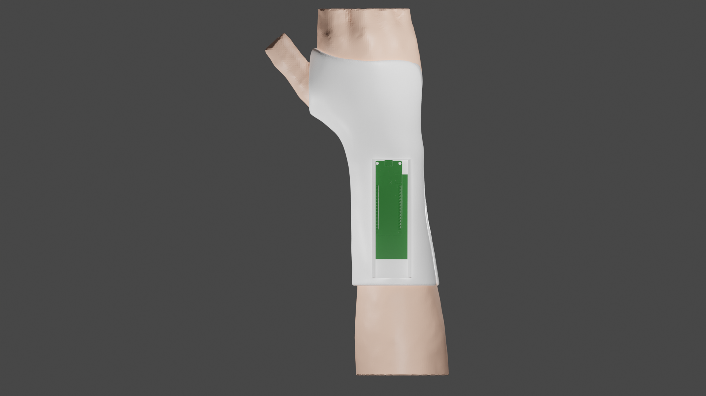
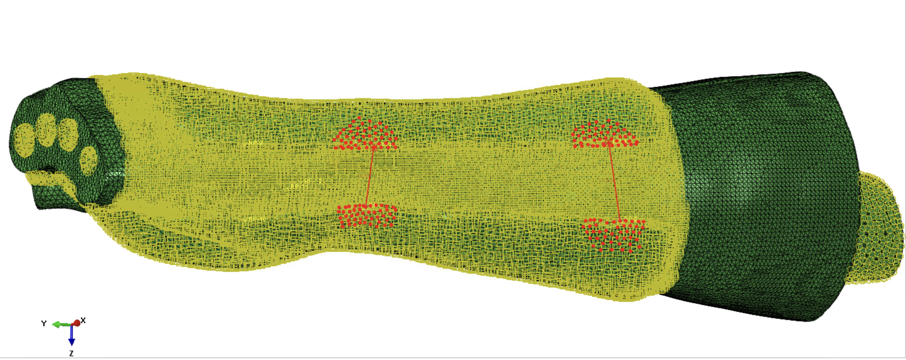
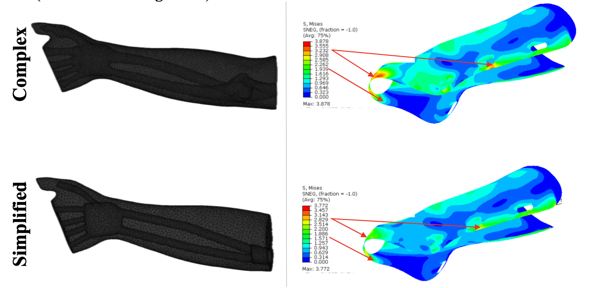
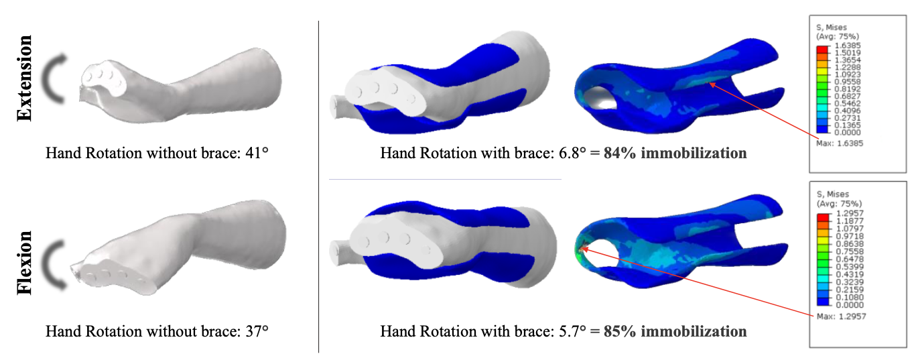
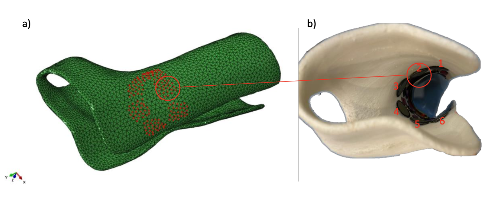
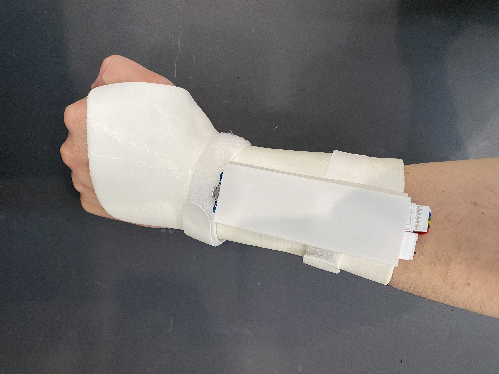

# Personalized 3D-Printed Hand Brace with Pressure Sensors

Patient-specific wearable orthosis integrating embedded pressure sensing for continuous biomechanical monitoring and improved comfort.

**Status:** Completed (MSc Thesis)
**Institution:** Delft University of Technology
**Role:** Lead Design & Development
**Domain:** Medical Device • Wearable Biomechanics • Additive Manufacturing

---

# 📌 Abstract / Overview

This project presents the design and evaluation of a personalized 3D-printed hand brace integrating pressure sensors for continuous monitoring of the hand–orthosis interface. The work combines biomechanical design, additive manufacturing, embedded sensing, and regulatory-oriented risk analysis to improve patient comfort and enable quantitative clinical feedback.

The proposed system aims to bridge the gap between conventional passive orthoses and data-driven wearable medical devices.

---

# ❗ Problem Statement

Conventional hand orthoses often suffer from:

* Poor anatomical fit
* Lack of quantitative feedback
* Localized pressure discomfort
* Limited capability for continuous monitoring

These limitations reduce patient compliance and restrict clinicians’ ability to objectively evaluate orthotic performance.

---

# 🎯 Project Objectives

The main objectives were:

* Develop a **patient-specific hand orthosis**
* Integrate **embedded pressure sensing**
* Ensure **biocompatible and comfortable design**
* Validate structural integrity via FEA
* Perform **risk analysis aligned with ISO 14971**
* Demonstrate manufacturability via 3D printing

---

# 🛠 Methodology & Design Process

## 1️⃣ Patient-Specific Design

The orthosis geometry was customized to match patient anatomy using CAD modeling and iterative refinement.

**Key design considerations:**

* ergonomic contouring
* ventilation and weight reduction
* strap positioning
* sensor placement zones

---

## 2️⃣ Finite Element Analysis (FEA)

FEA was conducted to:

* evaluate stress distribution
* identify pressure concentration zones
* verify structural safety
* support design optimization

---

[Watch demo](assets/videos/Abaqus-Ext.mp4)

---

---

## 3️⃣ Embedded Pressure Sensing

The brace integrates pressure sensors enabling continuous interface monitoring.

**System capabilities:**

* localized pressure measurement
* potential real-time feedback
* support for clinical evaluation

---

## 4️⃣ Prototyping & Manufacturing

**Manufacturing method:** Additive Manufacturing (3D Printing)

Technologies evaluated:

* FDM
* SLA

**Key manufacturing considerations:**

* print orientation
* surface finish for skin contact
* dimensional accuracy
* repeatability

---

# 📊 Validation & Results

The developed orthosis demonstrated:

* successful patient-specific fit
* reliable pressure sensing capability
* improved comfort compared to rigid orthoses
* structural integrity confirmed via FEA
* risk analysis completed per ISO 14971 framework

---

# 🔍 Key Insights

* Personalization significantly improves wearability
* Additive manufacturing enables rapid customization
* Embedded sensing adds valuable clinical feedback
* Early risk analysis supports MDR readiness

---

# 🚀 Impact

This work contributes toward next-generation **smart wearable orthoses** that combine mechanical support with quantitative monitoring, supporting the transition toward data-driven rehabilitation devices.

---
# 💻 Code & Data Processing

The project includes embedded sensing and data processing components used to acquire and analyze interface pressure measurements.

## Key Capabilities

* Pressure sensor data acquisition
* Signal filtering and preprocessing
* Data visualization and analysis
* Support for experimental validation workflows

## Technologies Used

* Python
* Arduino IDE
* Embedded pressure sensors
* Serial communication

---

⚠️ *Note:* The repository contains representative code for demonstration purposes. Hardware-specific configurations may be simplified for portability.

# 🔮 Future Work

* wireless data transmission
* real-time monitoring platform
* extended clinical validation
* design for scalable mass customization

---

# 🎥 Media

## Demo Video

[Watch demo](assets/videos/Hand-Brace-Short.mp4)

---

# 📄 Documentation

* MSc Thesis (link if publicly shareable)
* Risk analysis summary
* Test methodology

---

# 🔒 Confidentiality Note

This repository contains selected technical material for portfolio purposes. Sensitive or proprietary details have been intentionally omitted.
